> *Raft is a consensus algorithm for managing a replicated log. It produces a result equivalent to **(multi-)Paxos**, and it is as efficient as Paxos, but its structure is different from Paxos; this makes Raft more understandable than Paxos and also provides a better foundation for build- ing practical systems. In order to enhance understandabil- ity, Raft separates the key elements of consensus, such as **leader election, log replication, and safety,** and it enforces a stronger degree of coherency to reduce the number of states that must be considered. Results from a user study demonstrate that Raft is easier for students to learn than Paxos. Raft also includes a new mechanism for changing the cluster membership, which uses overlapping majori- ties to guarantee safety.*
> > #### NOTES:
> > 1. raft等效于multi-paxos。
> > 2. raft一直协议由多个独立的部分组成：**选主**、**日志复制**和**安全**。

> **Strong leader:** Raft uses a stronger form of leader- ship than other consensus algorithms. For example, log entries only flow from the leader to other servers. This simplifies the management of the replicated log and makes Raft easier to understand.
> > #### NOTE:
> > 1.日志只能从主机拷贝到备机。（和Paxos有什么区别？）

> **Leader election:** Raft uses randomized timers to elect leaders. This adds only a small amount of mechanism to the heartbeats already required for any consensus algorithm, while resolving conflicts sim- ply and rapidly.
> > #### NOTES:
> > 1.通过简单改造心跳协议，raft采用了**随机计时器**来选主，从而可以快速简单的坚决选注冲突的问题。

> **Membership changes:** Raft’s mechanism for changing the set of servers in the cluster uses a new joint consensus approach where the majorities of two different configurations overlap during transi- tions. This allows the cluster to continue operating normally during configuration changes.
> > #### NOTES:
> > 1. 为了解决成员变更的问题，raft使用了一种**联合一致方法**（使用两个配置重叠的大多数机器）。这种方法可以保证在集群变更的时候也可以正常操作。

> **Replicated state machines**
> Consensus algorithms typically arise in the context of replicated state machines [37]. In this approach, state ma- chines on a collection of servers compute identical copies of the same state and can continue operating even if some of the servers are down. Replicated state machines are used to solve a variety of fault tolerance problems in dis- tributed systems. For example, large-scale systems that have a single cluster leader, such as GFS [8], HDFS [38], and RAMCloud [33], typically use a separate replicated state machine to manage leader election and store config- uration information that must survive leader crashes. Ex- amples of replicated state machines include Chubby [2] and ZooKeeper [11].
> > #### NOTES:
> > 1. 一般提到一致性协议便会联系到**复制状态机**。
> > 2. 复制状态机通常被用来解决分布式系统中的容错问题。
> > 3. 在分布式大规模系统中存在master节点的，需要使用**复制状态机来管理选主**和存储的相关配置信息。
> > 4. 使用复制状态机的典型系统如：chubby和zookeeper。

> Replicated state machines are typically implemented using a replicated log, as shown in Figure 1. Each server stores a log containing a series of commands, which its state machine executes in order. Each log contains the same commands in the same order, so each state ma- chine processes the same sequence of commands. Since the state machines are deterministic, each computes the same state and the same sequence of outputs.
> 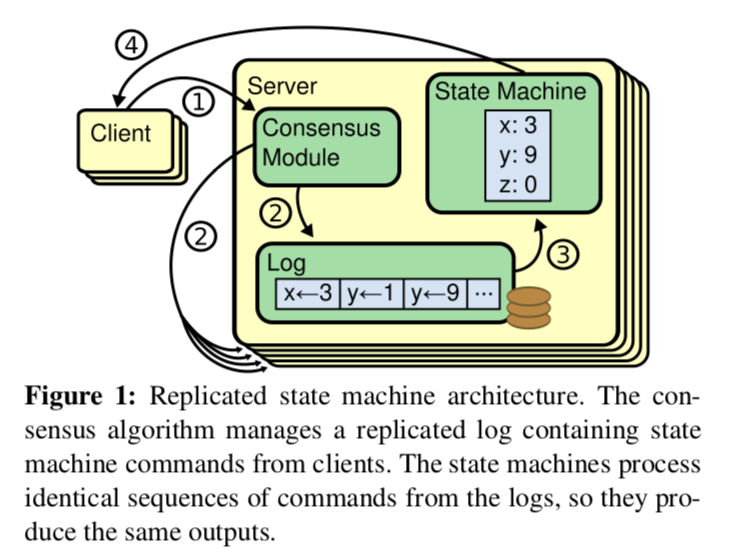
> > #### NOTES:
> > 1. 复制状态机的实现通常是通过使用复制日志来实现的。
> > 2. 每台机器的状态机具有相同的起始状态，另外每台机器都有一个存储操作的日志文件，操作序列在每台机器上都有相同的顺序。所有的操作按顺序在扭转状态机，则可以保证每台机器都有相同的输出序列。

> They ensure safety (never returning an incorrect re- sult) under all non-Byzantine conditions, including network delays, partitions, and packet loss, duplica- tion, and reordering.
> > #### NOTES:
> > 1. 在非拜占庭条件下，一致性协议应该保证在网络延迟、分区、丢包、重复和乱序情况下返回正确结果。
> > 2. 拜占庭将军问题（Byzantine failures），是由莱斯利·兰伯特提出的点对点通信中的基本问题。含义是在存在消息丢失的不可靠信道上试图通过消息传递的方式达到一致性是不可能的。因此对一致性的研究一般假设信道是可靠的，或不存在本问题。

> They are fully functional (available) as long as any majority of the servers are operational and can com- municate with each other and with clients. Thus, a typical cluster of five servers can tolerate the failure of any two servers. Servers are assumed to fail by stopping; they may later recover from state on stable storage and rejoin the cluster.
> > #### NOTES:
> > 1. 一致性协议需要保证在大多数服务器存活的情况下仍可以正常工作，不可服务的机器恢复并加入到集群中。

> They do not depend on timing to ensure the consis-tency of the logs: faulty clocks and extreme message delays can, at worst, cause availability problems.
> > #### NOTES:
> > 1. 一致性协议并不通过时间来保证一致。
> > 2. 如果通过时间来保证日志一致，那么错误的时钟、严重的网络延迟都会导致可用性问题。

> In the common case, a command can complete as soon as a majority of the cluster has responded to a single round of remote procedure calls; a minority of slow servers need not impact overall system perfor- mance.
> > #### NOTES:
> > 1. 尽量在一轮RPC后保证集群的大多数快速相应。
> > 2. 不能因为少数慢速服务降低整个系统的性能。

> Over the last ten years, Leslie Lamport’s Paxos proto- col [15] has become almost synonymous with consensus: it is the protocol most commonly taught in courses, and most implementations of consensus use it as a starting point. Paxos first defines a protocol capable of reaching agreement on a single decision, such as a single replicated log entry. We refer to this subset as single-decree Paxos. Paxos then combines multiple instances of this protocol to facilitate a series of decisions such as a log (multi-Paxos). Paxos ensures both safety and liveness, and it supports changes in cluster membership. Its correctness has been proven, and it is efficient in the normal case.
> > #### NOTES:
> > 1. Paxos最初提出了对于单次提议达成一致的协议。 *single-decree Paxos* 
> > 2. 基于单次的一致性协议，通过多个实例来达成一系列提议。*multi-Paxos*
> > 3. Paxos保证安全、生存，并且支持集群成员变更。并且正确性是经过证明的，在正常情况下都是有效的。

> Unfortunately, Paxos has two significant drawbacks. The first drawback is that Paxos is exceptionally diffi- cult to understand. The full explanation [15] is notori- ously opaque; few people succeed in understanding it, and only with great effort. As a result, there have been several attempts to explain Paxos in simpler terms [16, 20, 21]. These explanations focus on the single-decree subset, yet they are still challenging. In an informal survey of atten- dees at NSDI 2012, we found few people who were com- fortable with Paxos, even among seasoned researchers. We struggled with Paxos ourselves; we were not able to understand the complete protocol until after reading sev- eral simplified explanations and designing our own alter- native protocol, a process that took almost a year.
> > #### NOTES:
> > 1. Paxos第一个缺点就是艰涩难懂，即便是single-decree Paxos。

> We hypothesize that Paxos’ opaqueness derives from its choice of the single-decree subset as its foundation. Single-decree Paxos is dense and subtle: it is divided into two stages that do not have simple intuitive explanations and cannot be understood independently. Because of this, it is difficult to develop intuitions about why the single- decree protocol works. The composition rules for multi- Paxos add significant additional complexity and subtlety. We believe that the overall problem of reaching consensus on multiple decisions (i.e., a log instead of a single entry) can be decomposed in other ways that are more direct and obvious.
> > #### NOTES:
> > 1. single-decree Paxos之所以晦涩难懂，因为协议本身设计的紧凑精巧导致不能进行拆分理解。

> The second problem with Paxos is that it does not pro- vide a good foundation for building practical implemen- tations. One reason is that there is no widely agreed- upon algorithm for multi-Paxos. Lamport’s descriptions are mostly about single-decree Paxos; he sketched possi- ble approaches to multi-Paxos, but many details are miss- ing. There have been several attempts to flesh out and op- timize Paxos, such as [26], [39], and [13], but these differ from each other and from Lamport’s sketches. Systems such as Chubby [4] have implemented Paxos-like algo- rithms, but in most cases their details have not been pub- lished.
> > #### NOTES:
> > 1. Paxos的第二确定缺点是工程实现中没有大家都赞同的multi-Paxos的算法。存在很多multi-Paxos的不同实现，且大多细节是不公开的。

> Furthermore, the Paxos architecture is a poor one for building practical systems; this is another consequence of the single-decree decomposition. For example, there is lit- tle benefit to choosing a collection of log entries indepen- dently and then melding them into a sequential log; this just adds complexity. It is simpler and more efficient to design a system around a log, where new entries are ap- pended sequentially in a constrained order. Another prob- lem is that Paxos uses a symmetric peer-to-peer approach at its core (though it eventually suggests a weak form of leadership as a performance optimization). This makes sense in a simplified world where only one decision will be made, but few practical systems use this approach. If a series of decisions must be made, it is simpler and faster to first elect a leader, then have the leader coordinate the decisions.
> As a result, practical systems bear little resemblance to Paxos. Each implementation begins with Paxos, dis- covers the difficulties in implementing it, and then de- velops a significantly different architecture. This is time- consuming and error-prone, and the difficulties of under- standing Paxos exacerbate the problem. Paxos’ formula- tion may be a good one for proving theorems about its cor- rectness, but real implementations are so different from Paxos that the proofs have little value. The following com- ment from the Chubby implementers is typical:
> There are significant gaps between the description of the Paxos algorithm and the needs of a real-world system. . . . the final system will be based on an un- proven protocol [4].
> Because of these problems, we concluded that Paxos does not provide a good foundation either for system building or for education. Given the importance of con- sensus in large-scale software systems, we decided to see if we could design an alternative consensus algorithm with better properties than Paxos. Raft is the result of that experiment.
> > #### NOTES:
> > 1. 这么多内容就是讲Paxos从论文到实际系统还是异常困难的。
> > 2. 据说微信后台在开发Paxos协议时，三个人独立理解论文进行开发，并行测试三个人的实现，确认三个人理解一致后合同开发了最终版本。(^-^)，对于一个业余小白想独立开发一个生产环境的Paxos要上天啊。

> We had several goals in designing Raft: it must provide a complete and practical foundation for system building, so that it significantly reduces the amount of design work required of developers; it must be safe under all conditions and available under typical operating conditions; and it must be efficient for common operations. But our most important goal—and most difficult challenge—was un- derstandability. It must be possible for a large audience to understand the algorithm comfortably. In addition, it must be possible to develop intuitions about the algorithm, so that system builders can make the extensions that are in- evitable in real-world implementations.
> > ####NOTES:
> > 1. Raft的提出就是为了解决Paxos的晦涩难懂和工程实现问题。(Leslie Lamport大神的文章都是高屋建瓴)
> > 2. [Leslie Lamport Home Page](http://www.lamport.org)，看了下大佬的论文，183片文章，是著作等身的最好注解。

> We recognize that there is a high degree of subjectiv- ity in such analysis; nonetheless, we used two techniques that are generally applicable. The first technique is the well-known approach of problem decomposition: wher- ever possible, we divided problems into separate pieces that could be solved, explained, and understood relatively independently. For example, in Raft we separated leader election, log replication, safety, and membership changes.
> Our second approach was to simplify the state space by reducing the number of states to consider, making the system more coherent and eliminating nondeterminism where possible. Specifically, logs are not allowed to have holes, and Raft limits the ways in which logs can become inconsistent with each other. Although in most cases we tried to eliminate nondeterminism, there are some situ- ations where nondeterminism actually improves under- standability. In particular, randomized approaches intro- duce nondeterminism, but they tend to reduce the state space by handling all possible choices in a similar fashion (“choose any; it doesn’t matter”). We used randomization to simplify the Raft leader election algorithm.
> > #### NOTES:
> > 1. 为了设计便于理解的算法，作者运用了分解问题和减少状态机的方法降低理解的复杂度。
> > 2. Raft使用了随机的方法来简化选主。

> Raft is an algorithm for managing a replicated log of the form described in Section 2. Figure 2 summarizes the algorithm in condensed form for reference, and Figure 3 lists key properties of the algorithm; the elements of these figures are discussed piecewise over the rest of this sec- tion.
> 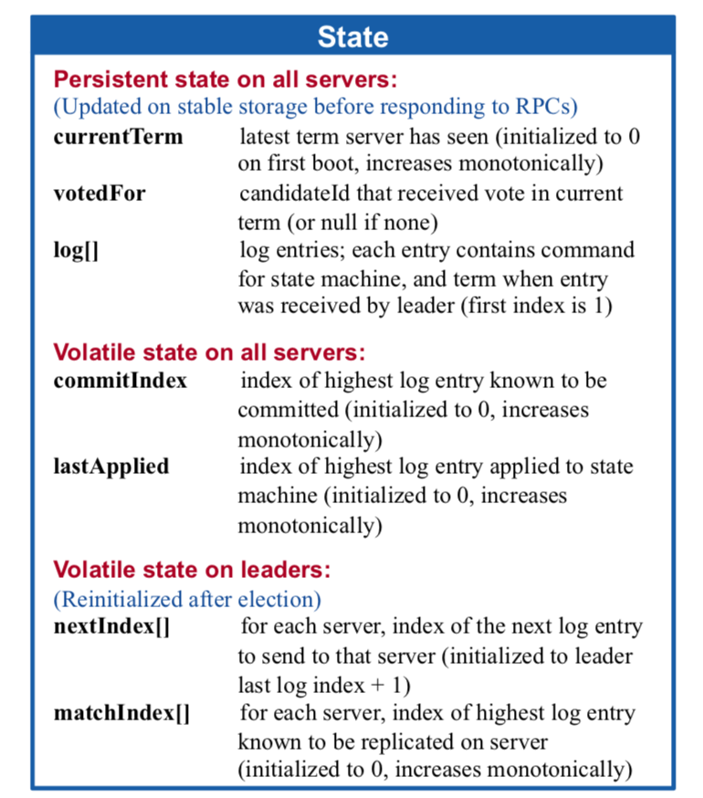
> > #### NOTES:
> > - **Persistent state on all servers**
> >     - 1. 持久的状态包含：currentTerm 、 votedFor 和 log[], 上面的状态会在进行rpc之前进行稳定存储介质的持久化。
> >     - 2. currentTerm : 当前服务可见的最新任期，初始为0且单调。
> >     - 3. votedFor : 当前任期已接受的候选ID。
> >     - 4. log[] : 日志记录，每个记录包含状态机的操作命令和被Leader接受的任期(索引初始化为1)。
> > - **Persistent state on all servers**
> >     - 1. commitIndex : 已知最高的已被提交的日志记录的索引（初始化为0，单调递增）。
> >     - 2. lastApplied : 已知最高的已被应用到状态记得日志记录的索引。
> > - **Volatile state on leaders**
> >     - 1. 选举后所有状态重新初始化。
> >     - 2. nextIndex[] : 存储发往每个server的下条日志的索引。(初始化为leader最后一条日志的索引+1)
> >     - 3. matchIndex[] : 存储将进行复制的日志记录的索引。(初始化为0，单调递增)

> 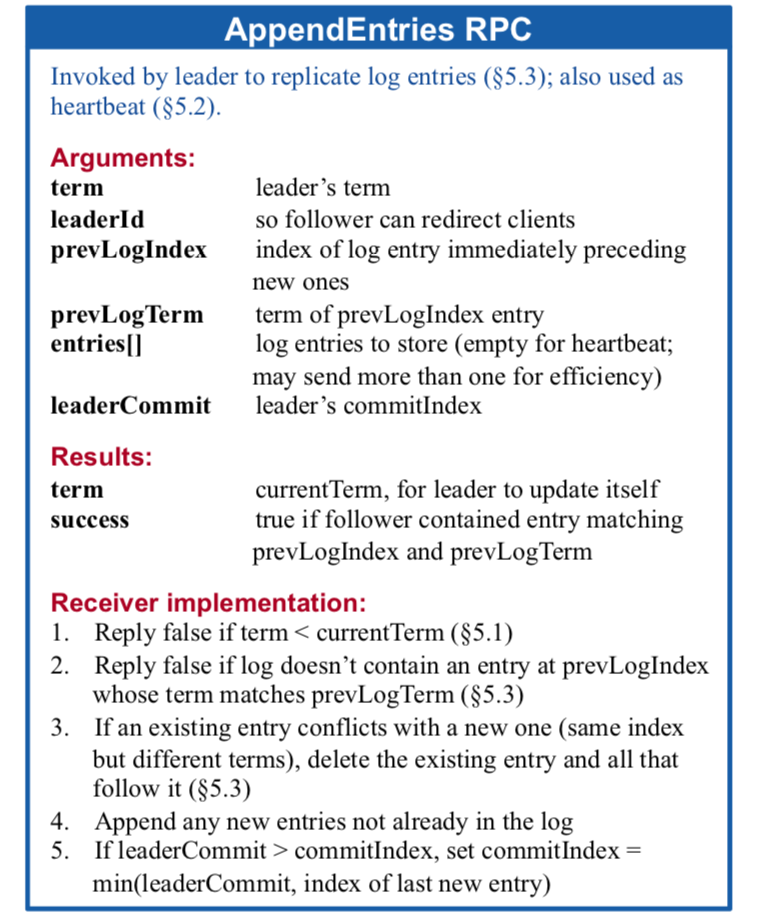 
> > #### NOTES:
> > - Leader进行复制日志和心跳。
> > - **Arguments**
> >     - **term** : leader的任期
> >     - **leaderId** : follower重定向请求到leader。
> >     - **prevLogIndex** : 最新一条日志的前继日志的索引。
> >     - **prevLogTerm** : 前继日志的任期。
> >     - **entries[]** : 日志存储。（为空时进行心跳探测）
> >     - **leaderCommit** : leader已提交的最大日志索引。
> > - **Results:**
> >     - **term** : 当前任期，Leader更新自己。
> >     - **success** : 如果follower包含和prevLogIndex、prevLogTerm匹配的日志
> > - **Receiver implementation**
> >     1. term < currentTerm ? false : true;
> >     2. 如果日志不包含和prevLogIndex、prevLogTerm匹配的日志返回false
> >     3. 如果存在和最新任期不同的日志，删除存在的日志，其他follower追赶它。
> >     4. 如果日志之前不存在，则直接存储
> >     5. if leaderCommit > commitIndex, set commitIndex = min(leaderCommit, index of last new entry)。

> 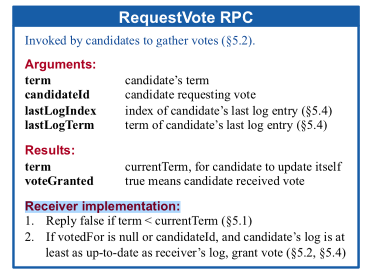
> > - 候选者发起获取选票。
> > - **Arguments**
> >     - **term** : 候选者任期
> >     - **candidateId** : 请求选票的候选者id。
> >     - **lastLogIndex** : 候选者最新一条日志的索引。
> >     - **lastLogTerm** : 候选者最新一条日志的任期。
> > - **Results**
> >     - **term** : 当前任期，用于候选者更新自己
> >     - **voteGranted** : 如果候选者获得选票，其值为真。
> > - **Receiver implementation**
> >     1. Reply false if term < currentTerm
> >     2. 如果当前任期已接受的候选为NULL或者等于请求选票的候选者id，并且候选的日志和接受者的日志保持一致，则获得当前选票。

> 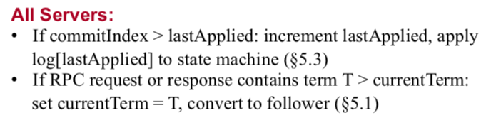
> > - **All Sercers** 
> >     1. 已提交的日志索引大于已应用的日志索引，增加已应用的日志索引，将log[lastApplied]应用到状态级。
> >     2. 如果请求rpc或者相应rpc包含任期大于currentTerm的任期T，设置currentTerm = T，切换到follower。

> 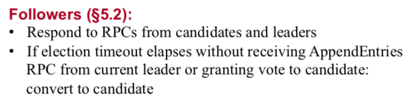
> > - **Followers**
> >     1. 响应候选者或者leader的rpc。
> >     2. 如果选举超时内，没有接受到leader的AppendEntries, 同时也没有接受到候选者的投票请求，自己则转化为候选者。

> 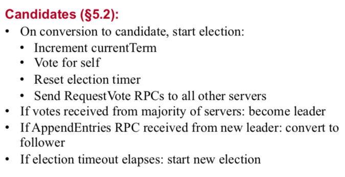
> > - **Candidates**
> >     1. 转换为候选者，开始进行选举。
> >         - 增加当前任期
> >         - 选举自己
> >         - 重置选举计时器
> >         - 发送选举rpc请求到其他的服务器
> >     2. 如果得到大多数机器的投票，则转变化leader。
> >     3. 如果接受搭配追加日志的rpc请求，则转变为follower
> >     4. 如果选举计时器超时，则重新进行选举。

> 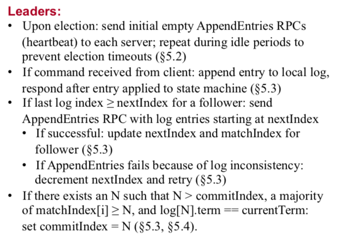
> > - **Leaders**
> >     1. 一旦当选为leader，发送空的追加日志rpc（心跳）请求到每个服务器，在空闲的事件发送心跳到其他机器，延长自己的任期。
> >     2. 如果接受到client的请求，追加日志到本地日志，当日志被执行到转台机后回应客户端。
> >     3. 如果一个追随者的日志索引大于下一条日志索引，发送追加日志的rpc请求，日志的索引是从下一跳日志索引开始。
> >         - 如果成功，更新follower的下一跳日志索引和匹配日志索引。
> >         - 如果因为不一致失败，减小下一跳日志索引并重试。
> >     4. 如果存在N,并且N大于已提交日志索引，同时匹配索引的大多数大于N, 并且这条日志的任期等于当前任期，设置已提交的日志索引为N。

> 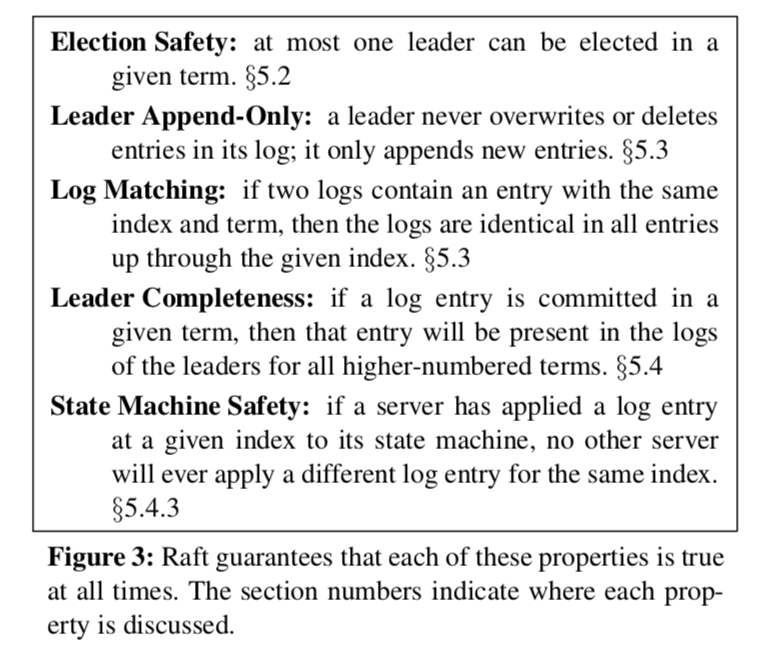
> > - **Properties**
> >     - Election Safety : 在一个选举周内最多被选举出一个Leader。
> >     - Leader Append-Only : 对于一个Leader永远不覆盖写和删除日志，只追加日志。
> >     - Log Matching : 如果日志包含两条entry有相同的索引和任期，那么日志是唯一在所有的跟定索引。
> >     - Leader Completeness : 如果一条日志记录在一个跟定的任期内已经提交，对于所有大于当前任期的任期，这条日志都是存在的。
> >     - State Machine Safety : 如果一个服务器应用一条跟定索引的日志到到状态机，那么其他所有的机器不允许应用一个有相同索引但内容不同的日志。

> Raft is an algorithm for managing a replicated log of the form described in Section 2. Figure 2 summarizes the algorithm in condensed form for reference, and Figure 3 lists key properties of the algorithm; the elements of these figures are discussed piecewise over the rest of this sec- tion.
> Raft implements consensus by first electing a distin- guished leader, then giving the leader complete responsi- bility for managing the replicated log. The leader accepts log entries from clients, replicates them on other servers, and tells servers when it is safe to apply log entries to their state machines. Having a leader simplifies the man- agement of the replicated log. For example, the leader can decide where to place new entries in the log without con- sulting other servers, and data flows in a simple fashion from the leader to other servers. A leader can fail or be- come disconnected from the other servers, in which case a new leader is elected.
> > #### NOTES:
> > 1. 首先选出一个Leader。
> > 2. Leader具有控制状态机的责任。
> > 3. Leader从客户端接受日志记录，并发日志记录复制到其他server。
> > 4. 通知其他servers，当日志记录被安全的应用到状态机。
> > 5. 如果有一个Leader可以简化复制日志的管理。

> Given the leader approach, Raft decomposes the con- sensus problem into three relatively independent subprob- lems, which are discussed in the subsections that follow:
> > #### NOTES:
> > 1. Raft的一致性保证可以分解为3个子问题：选主、日志复制和安全。

> Leader election: a new leader must be chosen when an existing leader fails (Section 5.2).
> > #### NOTES:
> > 1. 当存在Leader失败的时候，必须选举一个新的Leader。

> Log replication: the leader must accept log entries from clients and replicate them across the cluster, forcing the other logs to agree with its own (Sec- tion 5.3).
> > #### NOTES:
> > 1. Leader必须接受client的日志请求，并且保证将日志复制到集群的其他机器。

> Safety: the key safety property for Raft is the State Machine Safety Property in Figure 3: if any server has applied a particular log entry to its state machine, then no other server may apply a different command for the same log index. Section 5.4 describes how Raft ensures this property; the solution involves an additional restriction on the election mechanism de- scribed in Section 5.2.
> > #### NOTES:
> > 1. 安全性的重点是状态机的安全，如果某台机器应用一条日志到状态机，那么其他机器也必须是相同的日志，Raft通过附加的约束来保证。

> A Raft cluster contains several servers; five is a typical number, which allows the system to tolerate two failures. At any given time each server is in one of three states: leader, follower, or candidate. In normal operation there is exactly one leader and all of the other servers are fol- lowers. Followers are passive: they issue no requests on their own but simply respond to requests from leaders and candidates. The leader handles all client requests (if a client contacts a follower, the follower redirects it to the leader). The third state, candidate, is used to elect a new leader as described in Section 5.2. Figure 4 shows the states and their transitions; the transitions are discussed below.
> > #### NOTES:
> > 1. N = 2F + 1,应用Raft协议可以保证在F机器不能工作情况下，仍然能保证一致正常工作。
> > 2. 一台机器可能处于三种状态中的一种：Leader、Follower和Candidate。
> > 3. 正常状态下一台为Leader，其它为Followder。
> > 4. Follower是被动的，只是回应Leader和Candidate的请求。
> > 5. 所有客户端的请求都有Leader来负责处理，如果请求到达Follower，则会被重定向到Leader。

> 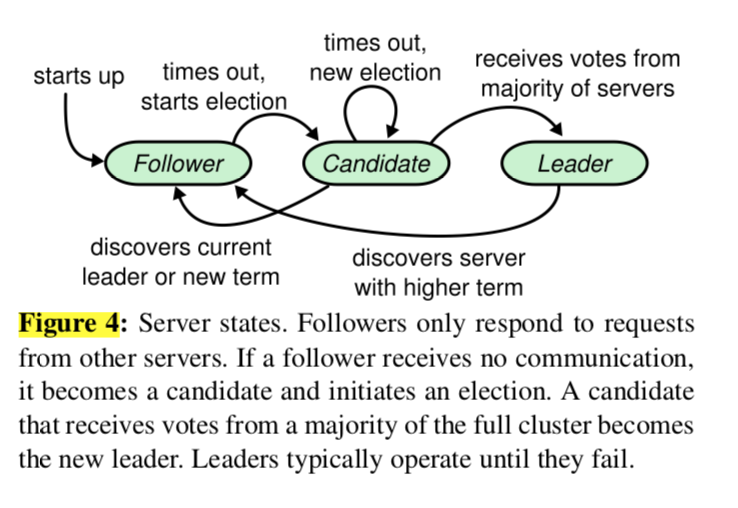
> > #### NOTES:
> > 1. 起始所有的机器均为Follower。
> > 2. 如果Follower的计时器超时，则Follwer转化自己为Candidate。
> > 3. 如果Candidate计时器超时，此时还没够Leader则继续作为Candidate。
> > 4. 如果Candidate发现选举出Leader，或者一个新的任期开始。则转化为Follower。
> > 5. 如果Candidate接受到大多Follower的选票，那么转化为Leader。
> > 6. 如果发现有更高的任期存在，则转化为Follower。

> Raft divides time into terms of arbitrary length, as shown in Figure 5. Terms are numbered with consecutive integers. Each term begins with an election, in which one or more candidates attempt to become leader as described in Section 5.2. If a candidate wins the election, then it serves as leader for the rest of the term. In some situations an election will result in a split vote. In this case the term will end with no leader; a new term (with a new election)will begin shortly. Raft ensures that there is at most one leader in a given term.
> > #### NOTES:
> > 1. Raft把事件切片为不同长度的任期。
> > 2. 每个任期有一个编号，编号为连续的整数。
> > 3. 每个任期的开始都是从选举开始的，此时有一个或者多个server尝试成为Leader。
> > 4. 一旦一个候选者在选举中获胜，这个任期内剩下的事件，这个server就作为Leader。
> > 5. 肯能存在某个任期没有成功选出Leader，那么下个任期将会开始。
> > 6. Raft保证每个任期内被选举出的Leader不多余一个。
> > 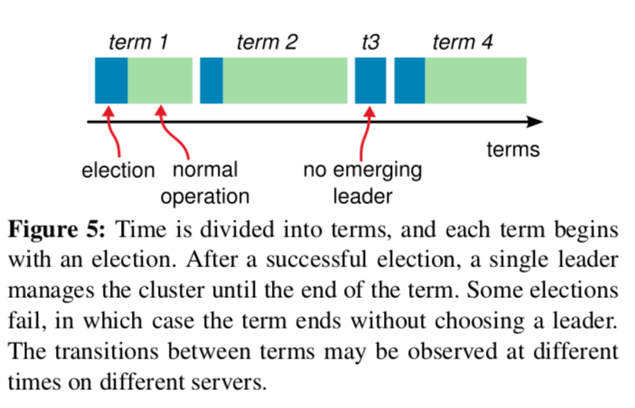

> Different servers may observe the transitions between terms at different times, and in some situations a server may not observe an election or even entire terms. Terms act as a logical clock [14] in Raft, and they allow servers to detect obsolete information such as stale leaders. Each server stores a current term number, which increases monotonically over time. Current terms are exchanged whenever servers communicate; if one server’s current term is smaller than the other’s, then it updates its current term to the larger value. If a candidate or leader discovers that its term is out of date, it immediately reverts to fol- lower state. If a server receives a request with a stale term number, it rejects the request.
> > #### NOTES:
> > 1. 任期在Raft中扮演这逻辑锁的概念, 他们允许每个server获取leeder的信息。
> > 2. 每个机器存在一个单调递增的current term number。
> > 3. 当机器交互时，会进行当前任期的交换。
> > 4. 如果一个机器的任期小于其它机器的任期，它会将自己任期更新为最大的任期。
> > 5. 如果一个候选者或者leader发现自己的任期过期，则会扭转到follower状态。
> > 6. 如果一台机器接受到一个老任期的请求，则直接拒绝。

> Raft servers communicate using remote procedure calls (RPCs), and the basic consensus algorithm requires only two types of RPCs. RequestVote RPCs are initiated by candidates during elections (Section 5.2), and Append- Entries RPCs are initiated by leaders to replicate log en- tries and to provide a form of heartbeat (Section 5.3). Sec- tion 7 adds a third RPC for transferring snapshots between servers. Servers retry RPCs if they do not receive a re- sponse in a timely manner, and they issue RPCs in parallel for best performance.
> > #### NOTES:
> > 1. Raft的机器之间是通过rpc来进行通信，rpc只需RequestVote RPCs 和Append- Entries RPCs。
> > 2. RequestVote RPCs 是candidate在候选期间使用的。
> > 3. Append- Entries RPCs 是复制日志和保持心跳。
> > 4. 另外一种rpc用来交换机器的快照。
> > 5. 对于重试请求可以通过并发可以获得更好的性能。

> Raft uses a heartbeat mechanism to trigger leader elec- tion. When servers start up, they begin as followers. A server remains in follower state as long as it receives valid RPCs from a leader or candidate. Leaders send periodic heartbeats (AppendEntries RPCs that carry no log entries) to all followers in order to maintain their authority. If a follower receives no communication over a period of time called the election timeout, then it assumes there is no vi- able leader and begins an election to choose a new leader.
> > #### NOTES:
> > 1. Raft使用心跳机制来触发选主。
> > 2. 机器启动是都是Follower，如果一台机器接受到来自Leader或者candidate的合法请求，它就保持在Follower状态。
> > 3. Leader通过发送周期性心跳来保证自己的权限。
> > 4. 如果选举定时器超时，则发起选举进行新一个任期的选举。 

> To begin an election, a follower increments its current term and transitions to candidate state. It then votes for itself and issues RequestVote RPCs in parallel to each of the other servers in the cluster. A candidate continues in this state until one of three things happens: (a) it wins the election, (b) another server establishes itself as leader, or (c) a period of time goes by with no winner. These out- comes are discussed separately in the paragraphs below.
> > #### NOTES:
> > 1. 选举开始，追随者增加自己的当前任期，并且转变为候选者状态。 
> > 2. 然后候选者发起请求，推荐选举自己，通过并发RequestVote RPCs到集群中。
> > 3. 出现三种情况，将导致候选者的状态发生迁移:
> >     - 赢得选举
> >     - 有server证实自己获得选举
> >     - 或者一段事件后，集群中没有人获得选举

> A candidate wins an election if it receives votes from a majority of the servers in the full cluster for the same term. Each server will vote for at most one candidate in a given term, on a first-come-first-served basis (note: Sec- tion 5.4 adds an additional restriction on votes). The ma- jority rule ensures that at most one candidate can win the election for a particular term (the Election Safety Prop- erty in Figure 3). Once a candidate wins an election, it becomes leader. It then sends heartbeat messages to all of the other servers to establish its authority and prevent new elections.
> > #### NOTES:
> > 1. 当一个候选者在一个任期内，获得集群中大多数的机器的选票，则候选者在选举中胜出成为leader。
> > 2. 在一个任期内，一个server最多选举一个候选者，并且遵守先到先服务的原则。
> > 3. 众多的规则保证在一个特定的周期内，最多只有一个候选者可以选举胜出。
> > 4. 一旦Candidate获得选举胜出成为Leader，它将发送心跳到集群的其他机器确认自己的授权，并组织发起新的选举。

> While waiting for votes, a candidate may receive an AppendEntries RPC from another server claiming to be leader. If the leader’s term (included in its RPC) is at least as large as the candidate’s current term, then the candidate recognizes the leader as legitimate and returns to follower state. If the term in the RPC is smaller than the candidate’s current term, then the candidate rejects the RPC and con- tinues in candidate state.
> > #### NOTES:
> > 1. 当候选者处在等待选票的状态时，候选者如果接受到来自其他机器的请求，并声称自己是leader，只有当leader的任期大于等于自己本地任期，才认为当前leader是合法的并迁移到Follower的状态。否则候选者可以拒绝假Leader的请求，并保持在候选者状态。

> The third possible outcome is that a candidate neither wins nor loses the election: if many followers become candidates at the same time, votes could be split so that no candidate obtains a majority. When this happens, each candidate will time out and start a new election by incre- menting its term and initiating another round of Request- Vote RPCs. However, without extra measures split votes could repeat indefinitely.
> > #### NOTES:
> > 1. 第三种的可能是一个候选者既没有获胜也没有失败。（选举流产了）
> > 2. 选举流产的发生因为当所有Follower同时迁移到候选者状态，并同时向集群的其他机器发去选举的rpc请求。导致没有任何一个机器可以获得集群的多数派的选举。
> > 3. 当上面的这种情况发生，每个候选者将会超时，然后会发起新一轮的选举。
> > 4. 为了避免上述情况的发生，需要添加额外的约束，来保证不会无限期的发生。

> Raft uses randomized election timeouts to ensure that split votes are rare and that they are resolved quickly. To prevent split votes in the first place, election timeouts are chosen randomly from a fixed interval (e.g., 150–300ms). This spreads out the servers so that in most cases only a single server will time out; it wins the election and sends heartbeats before any other servers time out. The same mechanism is used to handle split votes. Each candidate restarts its randomized election timeout at the start of an election, and it waits for that timeout to elapse before starting the next election; this reduces the likelihood of another split vote in the new election. Section 9.3 shows that this approach elects a leader rapidly.
> > #### NOTES:
> > 1. Raft使用随机选举超时来解决选举分裂的情况并快速解决问题。
> > 2. 为了避免选举分裂的发生，选举发生时每个server随机选择一个选举超时时间[150,300]ms。
> > 3. 上面的随机选举超时可以保证在大多数情况下，只有一台Server发生超时。
> > 4. 选举超时的server可以在其他server还没有超时的情况下，选举胜出并发送心跳。
> > 5. 相同的机制来被用来防止选举分裂情况的发生。
> > 6. 每个候选者在启动选举的时候随机选择一个选举超时时间，这样可以降低下一个选举周期发生选举分裂的概率。
> > 7. Raft表明这样的选举是非常有效的。

> Elections are an example of how understandability guided our choice between design alternatives. Initially we planned to use a ranking system: each candidate was assigned a unique rank, which was used to select between competing candidates. If a candidate discovered another candidate with higher rank, it would return to follower state so that the higher ranking candidate could more eas- ily win the next election. We found that this approach created subtle issues around availability (a lower-ranked server might need to time out and become a candidate again if a higher-ranked server fails, but if it does so too soon, it can reset progress towards electing a leader). We made adjustments to the algorithm several times, but after each adjustment new corner cases appeared. Eventually we concluded that the randomized retry approach is more obvious and understandable.
> > #### NOTES:
> > 1. 作者提出的随机选主法是经过多次迭代和探索得出一个直观且易于理解的方案。 

> Once a leader has been elected, it begins servicing client requests. Each client request contains a command to be executed by the replicated state machines. The leader appends the command to its log as a new entry, then is- sues AppendEntries RPCs in parallel to each of the other servers to replicate the entry. When the entry has been safely replicated (as described below), the leader applies the entry to its state machine and returns the result of that execution to the client. If followers crash or run slowly, or if network packets are lost, the leader retries Append- Entries RPCs indefinitely (even after it has responded to the client) until all followers eventually store all log en- tries.
> > #### NOTES:
> > 1.正常流程:
> >     - Leader接受Client的请求，每个请求中包含一条命令。
> >     - Leader首先把请求作为日志记录到自己的日志中。
> >     - Leader并行通知Followers复制日志。
> >     - 当日志被安全复制后，Leader就将本条日志应用到状态机，并返回client成功。
> >     - 如果Follwer慢速或者宕机，或者网络发生丢包。Leader会不断并发Append- Entries RPCs，知道大部分Follower存储了日志记录。

> Logs are organized as shown in Figure 6. Each log en- try stores a state machine command along with the term number when the entry was received by the leader. The term numbers in log entries are used to detect inconsis- tencies between logs and to ensure some of the properties in Figure 3. Each log entry also has an integer index iden-tifying its position in the log.      
> 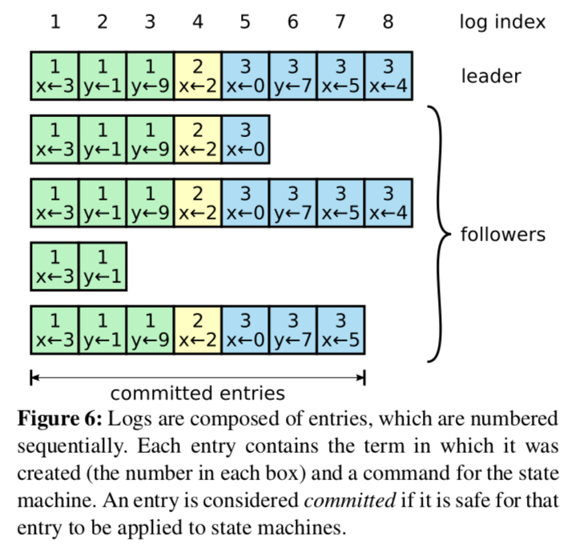
> > #### NOTES:
> > 1. 每条日志记录包含：状态机命令和任期。
> > 2. 任期是用来检测日志间的不一致性，从而保证Raft的某些特性。
> > 3. 每条日志有一个整数索引来标记它在日志中的位置。

> The leader decides when it is safe to apply a log en- try to the state machines; such an entry is called commit- ted. Raft guarantees that committed entries are durable and will eventually be executed by all of the available state machines. A log entry is committed once the leader that created the entry has replicated it on a majority of the servers (e.g., entry 7 in Figure 6). This also commits all preceding entries in the leader’s log, including entries created by previous leaders. Section 5.4 discusses some subtleties when applying this rule after leader changes, and it also shows that this definition of commitment is safe. The leader keeps track of the highest index it knows to be committed, and it includes that index in future AppendEntries RPCs (including heartbeats) so that the other servers eventually find out. Once a follower learns that a log entry is committed, it applies the entry to its local state machine (in log order).
> > #### NOTES:
> > 1. Leader来决策什么时候可以安全的应用日志记录到状态机。
> > 2. 这样的一条日志被成为*commited*(???)。
> > 3. Raft来保证已提交日志的持久性，并且将日志记录最终应用到大多数的状态机。
> > 4. 如果一条日志被大多数Follower成功复制，这条日志就是已提交的。
> > 5. 如果一条日志是已提交的，那么它之前的日志也必定是已提交的，尽管某条日志可能是前一个Leader创建的。
> > 6. 5.4节将会讨论更换Leader时，这些日志的状态也是安全的。
> > 7. Leader会追踪所有Follower的待提交日志的索引，同时也包含下次AppendEntries Rpcs的索引。Follower最终可以确定那些日志记录可以应用到状态机。
> > 8. 一旦Follower确定某条日志已处于提交状态，便会将这条记录应用到它自己的状态机。

> We designed the Raft log mechanism to maintain a high level of coherency between the logs on different servers. Not only does this simplify the system’s behavior and make it more predictable, but it is an important component of ensuring safety. Raft maintains the following proper- ties, which together constitute the Log Matching Property in Figure 3:
> > #### NOTES:
> > 1. Raft是通过Raft日志机制来保证不同机器上的日志是高度一致的。
> > 2. 不仅仅因为Raft日志机制可以简化系统的行为，同时也可以更好的预测系统的行为。同时它是一个保证安全行的重要组件。
> > 3. Raft是通过下面的两个性质，来保证Raft日志的匹配性质。

> If two entries in different logs have the same index and term, then they store the same command.
> > #### NOTES:
> > 1. 如果不同的日志的两条日志记录有相同的索引和任期，那么它们的状态机命令也一定是相同的。

> If two entries in different logs have the same index and term, then the logs are identical in all preceding entries.
> > #### NOTES:
> > 1.如果不同的日志的两条日志记录有相同的索引和任期，那么它们前继的所在的日志和当前的日志记录在相同的日志文件。

> The first property follows from the fact that a leader creates at most one entry with a given log index in a given term, and log entries never change their position in the log. The second property is guaranteed by a simple con- sistency check performed by AppendEntries. When send- ing an AppendEntries RPC, the leader includes the index and term of the entry in its log that immediately precedes the new entries. If the follower does not find an entry in its log with the same index and term, then it refuses the new entries. The consistency check acts as an induction step: the initial empty state of the logs satisfies the Log Matching Property, and the consistency check preserves the Log Matching Property whenever logs are extended. As a result, whenever AppendEntries returns successfully, the leader knows that the follower’s log is identical to its own log up through the new entries.

> > #### NOTES:
> > 1. 第一个特性得到保证的原因是：一个Leader在一个任期的日志文件中，确定日志索引的日志记录最多只有一条。并且日志记录一旦确定索引就不会在变更。
> > 2. 第二个特性是通过AppendEntries的检测来保证的。
> > 3. 当Leader并发AppendEntries RPC的时候，那正在复制的日志记录的任期和索引一定是先于新的日志记录。
> > 4. 如果follower在它的日志中没有发现有相同的日志索引和任期的日志记录(这个时候为什么会存在相同索引和任期的日志记录)，它(这里应该是Leader)将拒绝新的日志记录。
> > 5. 一致性检测是通过国定的步骤：
> >     - 刚初始的日志是满足一致的匹配性质的。
> >     - 当增加日志记录的时候，一致性检测保证一致的匹配性质。
> >     - 结果，AppendEntries成功返回的时候，Leader就可以获知follower和自己的日志一样，可以通过新的日志记录。

> During normal operation, the logs of the leader and followers stay consistent, so the AppendEntries consis- tency check never fails. However, leader crashes can leave the logs inconsistent (the old leader may not have fully replicated all of the entries in its log). These inconsisten- cies can compound over a series of leader and follower crashes. Figure 7 illustrates the ways in which followers’ logs may differ from that of a new leader. A follower may be missing entries that are present on the leader, it may have extra entries that are not present on the leader, or both. Missing and extraneous entries in a log may span multiple terms.
> 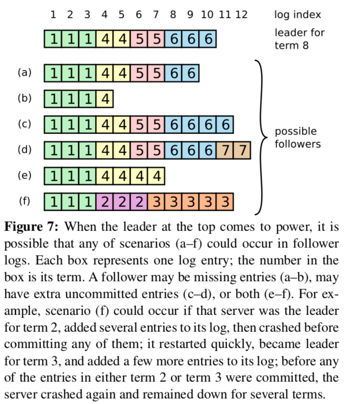
> > #### NOTES:
> > 1. 正常情况下，leader和follower的日志保持一致，所以AppendEntries一致性检测不会失败。
> > 2. 异常情况下，当leader还没有将自己的日志记录全部复制到follower，然后宕机会造成日志的不一致。
> > 3. 复杂的异常往往会混合一系列leader和follower的宕机。
> > 4. 图7列出了follwer和新leader日志不一致的情况。
> > 5. follower可能丢失leader有的日志记录，有可能follower比leader多了一些日志记录。丢失和多出的日志记录可能持续多个任期。 

> In Raft, the leader handles inconsistencies by forcing the followers’ logs to duplicate its own. This means that conflicting entries in follower logs will be overwritten with entries from the leader’s log. Section 5.4 will show that this is safe when coupled with one more restriction.
> > #### NOTES:
> > 1. 在Raft协议中，leader通过强制follower复制自己的协议来处理不一致性。
> > 2. 所以为了解决不一致，需要follower重新同步leader的日志，并覆写不一致的日志。
> > 3. 5.4节会描述当附加多个限制，这样的操作是安全的。

> To bring a follower’s log into consistency with its own, the leader must find the latest log entry where the two logs agree, delete any entries in the follower’s log after that point, and send the follower all of the leader’s entries after that point. All of these actions happen in response to the consistency check performed by AppendEntries RPCs. The leader maintains a nextIndex for each follower, which is the index of the next log entry the leader will send to that follower. When a leader first comes to power, it initializes all nextIndex values to the index just after the last one in its log (11 in Figure 7). If a follower’s log is inconsistent with the leader’s, the AppendEntries consis- tency check will fail in the next AppendEntries RPC. Af- ter a rejection, the leader decrements nextIndex and retries the AppendEntries RPC. Eventually nextIndex will reach a point where the leader and follower logs match. When this happens, AppendEntries will succeed, which removes any conflicting entries in the follower’s log and appends entries from the leader’s log (if any). Once AppendEntries succeeds, the follower’s log is consistent with the leader’s, and it will remain that way for the rest of the term.
> > #### NOTES:
> > 1. 为了保证follower和自己日志相同，leader需要确定follower和自己那些日志记录是相同的，然后删除follower和自己不相同的日志记录，再将follower不同的日志记录复制给follower。
> > 2. 上面的操作发生在AppendEntries RPCs的一致性检查后；如果不一致，则进行上面的过程。 
> > 3. leader维护了每一个follower的nextIndex，这个nextIndex记录了leader应该发给follower的下条日志的索引。
> > 4. 当一个leader刚获得选举的时候，它初始化所有的nexgIndex为自己日志记录最后一条日志记录的索引+1.
> > 5. 如果一个follower的日志和leader的日志不一致，AppendEntries一致性检测将会在下次AppendEntries RPC失败。
> > 6. 一致性检测失败后，leader将会减少自己维护的nextIndex,重新进行AppendEntries RPC。
> > 7. 重复上面的过程，leader和follower日志最终会达到一致。
> > 8. 上面的过程会删除follower和leader不一致的日志，并将leader的日志复制给follower。
> > 9. 上面的过程会保证leader和follower的日志保持一致，直到leader的任期结束。

> If desired, the protocol can be optimized to reduce the number of rejected AppendEntries RPCs. For example, when rejecting an AppendEntries request, the follower can include the term of the conflicting entry and the first index it stores for that term. With this information, the leader can decrement nextIndex to bypass all of the con- flicting entries in that term; one AppendEntries RPC will be required for each term with conflicting entries, rather than one RPC per entry. In practice, we doubt this opti- mization is necessary, since failures happen infrequently and it is unlikely that there will be many inconsistent en- tries.
> > #### NOTES:
> > 1. leader每次让nextIndex减1，然后通过AppendEntries RPC是否一致。这个流程是可以优化的。
> > 2. 当follower拒绝AppendEntries RPC的同时，可以返回日志冲突的任期和第一日志的索引。通过这些信息leader可以跳过所有冲突的日志。
> > 3. 通过上面的方面，leader接可以进行一次AppendEntries RPC解决日志冲突，而不是每条日志记录检测一次。
> > 4. 实际情况，这种优化不存在优化的必要性，因为不一致性发生的频率很低，此外不一致的日志记录数也很少。

> With this mechanism, a leader does not need to take any special actions to restore log consistency when it comes to power. It just begins normal operation, and the logs auto- matically converge in response to failures of the Append- Entries consistency check. A leader never overwrites or deletes entries in its own log (the Leader Append-Only Property in Figure 3).
> > #### NOTES:
> > 1. 通过上面的机制，当一个leader刚被徐局，不要额外的操作去恢复日志的一致性。它只需要开始正常的流程，当追加日志一致性检测失败后，日志的不一致将会逐渐收敛。这样leader不要重写和删除本地日志。

> This log replication mechanism exhibits the desirable consensus properties described in Section 2: Raft can ac- cept, replicate, and apply new log entries as long as a ma- jority of the servers are up; in the normal case a new entry can be replicated with a single round of RPCs to a ma- jority of the cluster; and a single slow follower will not impact performance.
> > #### NOTES:
> > 1. 这种日志复制机制满足在第二节我们所期望的一致性。当集群中大多数机器是正常时，Raft就可以接受、复制、应用新的日志记录。在正常的情况下，一个新的日志记录可以通过一轮RPCs被复制到其他机器。当集群中单个follower过慢，并不影响整个集群的性能。

> The previous sections described how Raft elects lead- ers and replicates log entries. However, the mechanisms described so far are not quite sufficient to ensure that each state machine executes exactly the same commands in the same order. For example, a follower might be unavailable while the leader commits several log entries, then it could be elected leader and overwrite these entries with new ones; as a result, different state machines might execute different command sequences.
> > #### NOTES:
> > 1. 上几节描述了Raft的选主和日志复制过程，这些机制并不能保证每个状态机按相同的顺序执行所有的命令。举个例子，一个follower可在leader提交了几条日志记录后不可用，然后它被选为下一个任期的leader并重写了这些日志，结果会导致不同的状态机按不同的顺序执行命令。

> This section completes the Raft algorithm by adding a restriction on which servers may be elected leader. The restriction ensures that the leader for any given term con- tains all of the entries committed in previous terms (the Leader Completeness Property from Figure 3). Given the election restriction, we then make the rules for commit- ment more precise. Finally, we present a proof sketch for the Leader Completeness Property and show how it leads to correct behavior of the replicated state machine.
> > #### NOTES:
> > 1. 这一节我们通过增加了如何选主的额外附加，这个限制可以保证新选举的leader包含了上一任期所有已提交的日志。通过选举限制，日志提交的过程变的更加准确。我们将证明选主的完整性以及它如何纠正状态机的行为。

> In any leader-based consensus algorithm, the leader must eventually store all of the committed log entries. In some consensus algorithms, such as Viewstamped Repli- cation [22], a leader can be elected even if it doesn’t initially contain all of the committed entries. These al- gorithms contain additional mechanisms to identify the missing entries and transmit them to the new leader, ei- ther during the election process or shortly afterwards. Un- fortunately, this results in considerable additional mecha- nism and complexity. Raft uses a simpler approach where it guarantees that all the committed entries from previous 
terms are present on each new leader from the moment of its election, without the need to transfer those entries to the leader. This means that log entries only flow in one di- rection, from leaders to followers, and leaders never over- write existing entries in their logs.
> > #### NOTES:
> > 1. 一致性算法中，leader需要包含所有已提交的日志，或者leader不包含所有的日志旦需要通过额外的机制保证清楚那些日志丢失并将丢失的日志传给新的leader。Raft使用了第一种方法，新选举的leader必须包含上一任期所有的日志。这种方法保证了日志的复制是单向流动的，只会从leader到follower，不需要从follower到leader。此外leader不要重写的自己的本地日志，只需要追加即可。

> Raft uses the voting process to prevent a candidate from winning an election unless its log contains all committed entries. A candidate must contact a majority of the cluster in order to be elected, which means that every committed entry must be present in at least one of those servers. If the candidate’s log is at least as up-to-date as any other log in that majority (where “up-to-date” is defined precisely below), then it will hold all the committed entries. The RequestVote RPC implements this restriction: the RPC includes information about the candidate’s log, and the voter denies its vote if its own log is more up-to-date than that of the candidate.
> > #### NOTES:
> > 1. Raft通过选举过程来组织一个后选择成为新的leader，除非它的日志包含上一个任期所有已提交的日志。一个候选者必须联系集群中大多数机器来获得选举胜出，这就以为这每条已提交的日志记录必须存在在至少一台机器中。如果候选者的日志包含大多数server的日志，那么候选者就拥有可所有已提交的日志。RequestVote RPC实现了这个限制，这个rpc包含了候选者的日志信息，如果投票者的日志比候选者日志信息更新，它将拒绝投票。

> Raft determines which of two logs is more up-to-date by comparing the index and term of the last entries in the logs. If the logs have last entries with different terms, then the log with the later term is more up-to-date. If the logs end with the same term, then whichever log is longer is more up-to-date.
> > #### NOTES:
> > 1. Raft通过比较日期和日志索引来决定那个日志更新。
> > 2. 如果不同最大的任期不同，直接比较谁的任期更新。
> > 3. 如果任期相同，则比较谁的日志记录更长。

> As described in Section 5.3, a leader knows that an en- try from its current term is committed once that entry is stored on a majority of the servers. If a leader crashes be- fore committing an entry, future leaders will attempt to finish replicating the entry. However, a leader cannot im- mediately conclude that an entry from a previous term is committed once it is stored on a majority of servers. Fig-ure 8 illustrates a situation where an old log entry is stored on a majority of servers, yet can still be overwritten by a future leader.
> 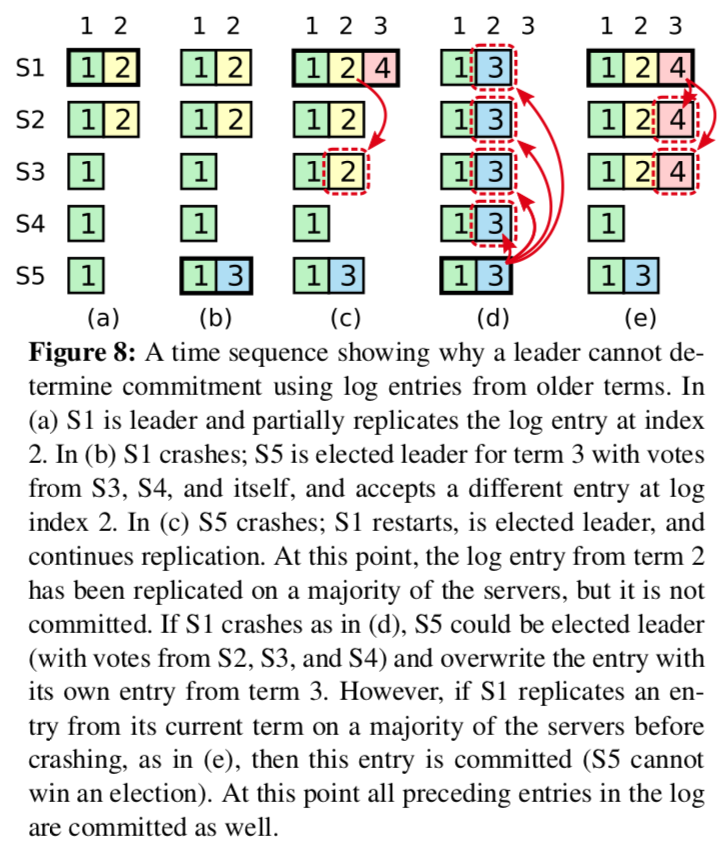
> > #### NOTES:
> > 1. 正如5.3节描述的，如果日志记录被存储到集群中大多数机器，leader可以直到自己任期的当前日志是被提交的。
> > 2. 如果一个leader还没有提交日志然后宕机，下任leader将会尝试完成日志的复制。
> > 3. 新当选的leader不能直接准确知道存储在集群的大多数机器上的一条记录是否是提交的。
> > 4. 图8给出了一种特殊情况，尽管一条日志被大多数机器存储，但是新的leader还是要覆盖的情况。

> To eliminate problems like the one in Figure 8, Raft never commits log entries from previous terms by count- ing replicas. Only log entries from the leader’s current term are committed by counting replicas; once an entry from the current term has been committed in this way, then all prior entries are committed indirectly because of the Log Matching Property. There are some situations where a leader could safely conclude that an older log en- try is committed (for example, if that entry is stored on ev- ery server), but Raft takes a more conservative approach for simplicity.
> > #### NOTES:
> > 1. 为了消除如图8的情况，Raft不会根据已复制的副本数提交前任的日志记录。
> > 2. 只有本任期内，Raft才会根据已复制的副本数来提交日志。
> > 3. 只有当本任期内的一条日志记录按照上面的方面已提交，由于日志匹配的性质会保证之前的日志也被提交。
> > 4. 这里存在一些情况下，leader可以直接断定日志已经提交，但是Raft采取保守的方法来简化设计。

> Raft incurs this extra complexity in the commitment rules because log entries retain their original term num- bers when a leader replicates entries from previous terms. In other consensus algorithms, if a new leader re- replicates entries from prior “terms,” it must do so with its new “term number.” Raft’s approach makes it easier to reason about log entries, since they maintain the same term number over time and across logs. In addition, new leaders in Raft send fewer log entries from previous terms than in other algorithms (other algorithms must send re- dundant log entries to renumber them before they can be committed).
> > #### NOTES:
> > Raft招致这种复杂度的愿意是因为日志复制的时候对于前一任期的日志仍保留其任期ID。
> > 在其它的一致性算法中，如果新任leader复制前任的日志会将任期修改为新的任期。

>  Given the complete Raft algorithm, we can now ar- gue more precisely that the Leader Completeness Prop- erty holds (this argument is based on the safety proof; see Section 9.2). We assume that the Leader Completeness Property does not hold, then we prove a contradiction. Suppose the leader for term T (leaderT) commits a log entry from its term, but that log entry is not stored by the leader of some future term. Consider the smallest term U > T whose leader (leaderU) does not store the entry
> > #### NOTES:
> > 1. 给出完成的Raft算法后，我们可以进一步讨论leader的完整性。
> > 2. 对于leader的完整性我们假定不成立，然后证明它的不成立。（反证法）
> > 3. 假定leader在任期T提交了一条日志，但是日志记录没有被未来任期的leader所记录。考虑任期ID最小但大于任期T的任期U没有存储日志记录。

> 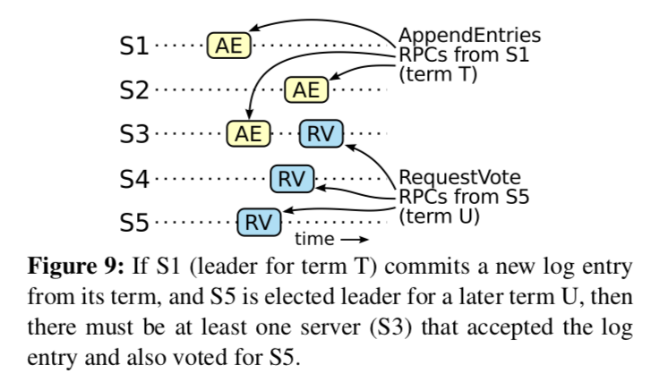
>  The committed entry must have been absent from leaderU’s log at the time of its election (leaders never delete or overwrite entries).
> > #### NOTES:
> > 1. 当任期U的leader当选的时候，它的日志中不存在已提交的日志。

> leaderT replicated the entry on a majority of the clus- ter, and leaderU received votes from a majority of the cluster. Thus, at least one server (“the voter”) both accepted the entry from leaderT and voted for leaderU, as shown in Figure 9. The voter is key to reaching a contradiction.
> > #### NOTES:
> > 1. 任期T的leader将日志复制到集群中多数的机器上，并且任期U的leader接受了集群中多数的投票。如图9所示，集群中至少存在一台机器既接受了leaderT复制的日志也投票给了leaderU。投票者是反证法的关键。

> The voter must have accepted the committed entry from leaderT before voting for leaderU; otherwise it would have rejected the AppendEntries request from leaderT (its current term would have been higher than T).
> > 1. 投票者先接受leaderT的复制日志，然后投票给leaderU。
> > 2. 否则，它将拒绝来自leaderT的AppendEntries的请求。

> The voter still stored the entry when it voted for leaderU, since every intervening leader contained the entry (by assumption), leaders never remove entries, and followers only remove entries if they conflict with the leader.
> > #### NOTES:
> > 1. 当候选者投票给leaderU的时候，它还存储来自leaderT的复制日志。因为每一个leader包含这条日志记录，leader永远不删除记录，followers只是删除和leader冲突的日志。

> The voter granted its vote to leaderU, so leaderU’s log must have been as up-to-date as the voter’s. This leads to one of two contradictions. 
> > #### NOTES:
> > 1. 投票这将票投给了leaderU，所以leaderU的日志一定比候选者的日志更新。这将会推导出下面两个矛盾：

> First, if the voter and leaderU shared the same last log term, then leaderU’s log must have been at least as long as the voter’s, so its log contained every entry in the voter’s log. This is a contradiction, since the voter contained the committed entry and leaderU was assumed not to.
> > #### NOTES:
> > 1. 首先，如果投票者和LeaderU有相同的最后日志任期，那么leaderU的日志一定等于或者长于投票者的日志。所以leaderU的日志包含了投票这的每一条日志。这是一个矛盾，既然投票者包含已提交的日志，而假设LeaderU不包含。

> Otherwise, leaderU’s last log term must have been larger than the voter’s. Moreover, it was larger than T, since the voter’s last log term was at least T (it con- tains the committed entry from term T). The earlier leader that created leaderU’s last log entry must have contained the committed entry in its log (by assump- tion). Then, by the Log Matching Property, leaderU’s log must also contain the committed entry, which is a contradiction.
> > #### NOTES:
> > 1. 另外，leaderU最后一条日志的任期一定是大于投票者最后一条日志的任期。进一步，这个任期是大于T。既然投票者的最后一条日志的任期至少为T，上任期的leader创建了leaderU的最后一条日志一定包含了已提交的一致。所以，根据日志匹配的性质，leaderU的日志必须包含已提交的日志，这是一个矛盾。

> This completes the contradiction. Thus, the leaders of all terms greater than T must contain all entries from term T that are committed in term T.
> > #### NOTES:
> > 1. 反证法完成，因此，所有任期大于T的leader一定包含了任期T提交的日志。

> The Log Matching Property guarantees that future leaders will also contain entries that are committed indirectly, such as index 2 in Figure 8(d).
> > #### NOTES:
> > 1. 日志匹配性质保证了将来任期的leader包含了那些间接提交的日志。例如图8的索引2所示。 

> Given the Leader Completeness Property, we can prove the State Machine Safety Property from Figure 3, which states that if a server has applied a log entry at a given index to its state machine, no other server will ever apply a different log entry for the same index. At the time a server applies a log entry to its state machine, its log must be identical to the leader’s log up through that entry and the entry must be committed. Now consider the lowest term in which any server applies a given log index; the Log Completeness Property guarantees that the leaders for all higher terms will store that same log entry, so servers that apply the index in later terms will apply the same value. Thus, the State Machine Safety Property holds.
> > #### NOTES:
> > 1. 给定leader的完整性质，我们可以证明状态机的安全性从图3。 
> > 2. 如果一个server将跟定索引的日志应用到了自己的状态机，那么其它机器应用相同索引的日志到状态机，那么相同索引的日志内容必须有相同的日志。   
> > 3. 当一台机器把日志应用到状态机，它的日志必须和leader的日志是一致的，并且日志状态是已提交的。
> > 4. 我们现在考虑在最小的任期下，任何一台机器应用跟定索引的日志。日志完整性保证那些任期更大的leader存储了相同的日志，所以后面任期应用的索引将会有相同的值。因此状态的安全性是成立的。

> Finally, Raft requires servers to apply entries in log in- dex order. Combined with the State Machine Safety Prop- erty, this means that all servers will apply exactly the same set of log entries to their state machines, in the same order.
> > #### NOTES:
> > 1. 最终，Raft需要服务器应用日志按照索引的顺序。结合日志的匹配安全特性，这意味这所有的服务器将应用相同的日志记录到状态机，并且日志有相同的顺序。

> Until this point we have focused on leader failures. Fol- lower and candidate crashes are much simpler to han- dle than leader crashes, and they are both handled in the same way. If a follower or candidate crashes, then fu- ture RequestVote and AppendEntries RPCs sent to it will fail. Raft handles these failures by retrying indefinitely; if the crashed server restarts, then the RPC will complete successfully. If a server crashes after completing an RPC but before responding, then it will receive the same RPC again after it restarts. Raft RPCs are idempotent, so this causes no harm. For example, if a follower receives an AppendEntries request that includes log entries already present in its log, it ignores those entries in the new re- quest.
> > #### NOTES:
> > 1. 现在我们讨论leader失败的问题。
> > 2. follower和candidate的失败比leader的失败容易处理。
> > 3. 如果follower和candidate崩溃，那么未来的RequestVote和AppendEntries RPCs将会失败。
> > 4. Raft通过重试来解决follower和candidate的崩溃。
> > 5. 如果崩溃的服务重启，这些重试RPC将会成功。
> > 6. 如果一个服务在完成一个RPC，但是还没响应的时候崩溃，重启后将会重新接受到相同的RPC请求。因为Raft的Rpcs是幂等的，所以不会引起问题。
> > 7. 举个例子，如果一个follower接受到一个AppendEntries的请求，请求中的日志已经在它自己的日志中，那么它可以忽略这些日志记录。

> One of our requirements for Raft is that safety must not depend on timing: the system must not produce incor- rect results just because some event happens more quickly or slowly than expected. However, availability (the ability of the system to respond to clients in a timely manner) must inevitably depend on timing. For example, if mes- sage exchanges take longer than the typical time between server crashes, candidates will not stay up long enough to win an election; without a steady leader, Raft cannot make progress.
> > #### NOTES:
> > 1. Raft的一个重要特点就是不依赖时间, 不能因为一些事件发生的比预期快或者慢就导致一些不正确的结果。
> > 2. 然而可用性还是必然依赖于时间的, 例如，如果消息的交换华为的时间长于服务崩溃的典型时间，候选者将等待足够就而获得选举。没有一个稳定的leader，Raft将不能运转。

> Leader election is the aspect of Raft where timing is most critical. Raft will be able to elect and maintain a steady leader as long as the system satisfies the follow- ing timing requirement:
> **broadcastTime << electionTimeout << MTBF**
> In this inequality broadcastTime is the average time it takes a server to send RPCs in parallel to every server in the cluster and receive their responses; electionTime- out is the election timeout described in Section 5.2; and MTBF is the average time between failures for a single server. The broadcast time should be an order of mag- nitude less than the election timeout so that leaders can reliably send the heartbeat messages required to keep fol- lowers from starting elections; given the randomized ap- proach used for election timeouts, this inequality also makes split votes unlikely. The election timeout should be a few orders of magnitude less than MTBF so that the sys- tem makes steady progress. When the leader crashes, the system will be unavailable for roughly the election time- out; we would like this to represent only a small fraction of overall time.
> > #### NOTES:
> > 1. 选主是Raft的至关重要的一个部分，并且时间是致命的。如果可以选主或者leader保持稳定需要满足下面的时间要求：
> > 2. 在上面的不等式中，广播时间是服务并发Rpc往返的平均时间。
> > 3. 选举超时5.2节描述的选举超时。
> > 4. MTBF是平均故障间隔时间，它面试单台服务两次失败间隔的平均值。
> > 5. 广播时间严格小于选举超时时间，这样leader才能可靠的发送心跳，来完成刚获得选举之后保持通知到follower。
> > 6. 选举超时使用了随机化的方法，这个不等式还能保证选举分裂不可能发生。
> > 7. 选举超时时间必须远小于平均故障间隔时间，才能保证Raft的稳定运行。
> > 8. 如果leader崩溃，系统只有在选举时间间隔内不可用。我们可以预期选举不可用时间远远小于整个时间。

> The broadcast time and MTBF are properties of the un- derlying system, while the election timeout is something we must choose. Raft’s RPCs typically require the recip- ient to persist information to stable storage, so the broad- cast time may range from 0.5ms to 20ms, depending on storage technology. As a result, the election timeout is likely to be somewhere between 10ms and 500ms. Typical
server MTBFs are several months or more, which easily satisfies the timing requirement.
> > #### NOTES:
> > 1. 广播时间和平均故障间隔时间是下伏系统的特性，选举超时间必须我们所选择的。
> > 2. Raft的rpc往往需要将信息持久化到稳定设备，所以广播时间会在0.5ms和20ms之间波动，这个时间依赖于存储技术。
> > 3. 结果，选举超时时间大概率在10ms到500ms之间，典型下伏系统的平均故障间隔时间往往是几个月或者更久，这将轻松满足时间的要求。 

> Up until now we have assumed that the cluster config- uration (the set of servers participating in the consensus algorithm) is fixed. In practice, it will occasionally be nec- essary to change the configuration, for example to replace servers when they fail or to change the degree of replica- tion. Although this can be done by taking the entire cluster off-line, updating configuration files, and then restarting the cluster, this would leave the cluster unavailable dur- ing the changeover. In addition, if there are any manual steps, they risk operator error. In order to avoid these is- sues, we decided to automate configuration changes and incorporate them into the Raft consensus algorithm.
> > #### NOTES:
> > 1. 之前我们的讨论都是假设集群的配置是固定的。实际情况我们往往需要改变配置，例如替换掉失败的机器或者改变复制的自由度。
> > 2. 尽管我们可以通过让整个集群下线，更新配置并重启机器。但是将会导致整个集群在变更期间不可用。
> > 3. 除此之外，如果存在手工操作，将会加剧变更的风险。
> > 4. 为解决可停机变更，我们在Raft中支持了不停机情况下配置的自动变更。

> For the configuration change mechanism to be safe, there must be no point during the transition where it is possible for two leaders to be elected for the same term. Unfortunately, any approach where servers switch directly from the old configuration to the new configura- tion is unsafe. It isn’t possible to atomically switch all of the servers at once, so the cluster can potentially split into two independent majorities during the transition (see Fig- ure 10).
> > #### NOTES:
> > 1. 为了保证配置自动变更不存在风险，我们必须保证在变更期间不会有两台机器都被选举为leader。
> > 2. 不幸的是，任何由老配置直接变更为新配置的方法都是不安全的。也不可能自动同时更换所有的机器，所已集群可以容忍分裂为两部分在变更期间。

> In order to ensure safety, configuration changes must use a two-phase approach. There are a variety of ways to implement the two phases. For example, some systems (e.g., [22]) use the first phase to disable the old configura- tion so it cannot process client requests; then the second phase enables the new configuration. In Raft the cluster first switches to a transitional configuration we call joint consensus; once the joint consensus has been committed, the system then transitions to the new configuration. The joint consensus combines both the old and new configu- rations:
> > #### NOTES:
> > 1. 为了保证安全性，匹配的变更必须使用两阶段的方法。这里实现两阶段的方法有很多种，例如在第一阶段是老配置失效，这样就不能处理客户端的请求，第二阶段是新的配置生效。
> > 2. Raft协议中，先使集群切换到过渡配置，我们成为联合一致性。一旦联合一致性被提交，系统将迁移到新配置。
> > 3. 联合一致性结合了新老配置：

> - Log entries are replicated to all servers in both con- figurations.
> - Any server from either configuration may serve as leader.
> - Agreement (for elections and entry commitment) re- quires separate majorities from both the old and new configurations.
> > #### NOTES:
> > 1. 日志被复制到所有的新老配置中的机器。
> > 2. 新老配置中任何机器可以成为leader。
> > 3. 对于选举和复制需要分别得到新配置和老配置中大多数的同意。

> The joint consensus allows individual servers to transition between configurations at different times without com- promising safety. Furthermore, joint consensus allows the cluster to continue servicing client requests throughout the configuration change.
> > #### NOTES:
> > 1. 联合一致性允许独立的机器在不同的配置间进行切换，进一步，联合一致性允许在配置切换的整个过程中响应客户端的请求。

> Cluster configurations are stored and communicated using special entries in the replicated log; Figure 11 illus- trates the configuration change process. When the leader receives a request to change the configuration from Cold to Cnew, it stores the configuration for joint consensus (Cold,new in the figure) as a log entry and replicates that entry using the mechanisms described previously. Once a given server adds the new configuration entry to its log, it uses that configuration for all future decisions (a server always uses the latest configuration in its log, regardless of whether the entry is committed). This means that the leader will use the rules of Cold,new to determine when the log entry for Cold,new is committed. If the leader crashes, a new leader may be chosen under either Cold or Cold,new, depending on whether the winning candidate has received Cold,new. In any case, Cnew cannot make unilateral deci- sions during this period.
> > #### NOTES:
> > 1. 集群配置也是持久化存储的，通过特殊的rpc进行通信的。
> > 2. 图11展示可配置的交换过程。
> > 3. 当leader接受到请求将配置从老配置更换为新配置。然后leader将配置根据联合一致性存储为日志记录，并使用前述的机制将日志记录进行复制。
> > 4. 一个server接受到新配置的记录，他将使用新配置来进行未来的决定。
> > 5. 这也就意味着：leader将使用联合配置来决定一条日志是否应该提交。
> > 6. 如果leader崩溃，一个新的leader将会在配置老配置或联合配置下被选举。依赖于获胜的获选者是接受到联合配置。
> > 7. 无论如何，新配置不能单边的进行决定在配置更换的过程中。

> Once Cold,new has been committed, neither Cold nor Cnew can make decisions without approval of the other, and the Leader Completeness Property ensures that only servers with the Cold,new log entry can be elected as leader. It is now safe for the leader to create a log entry describing Cnew and replicate it to the cluster. Again, this configura- tion will take effect on each server as soon as it is seen. When the new configuration has been committed under the rules of Cnew, the old configuration is irrelevant and servers not in the new configuration can be shut down. As shown in Figure 11, there is no time when Cold and Cnew can both make unilateral decisions; this guarantees safety.
> 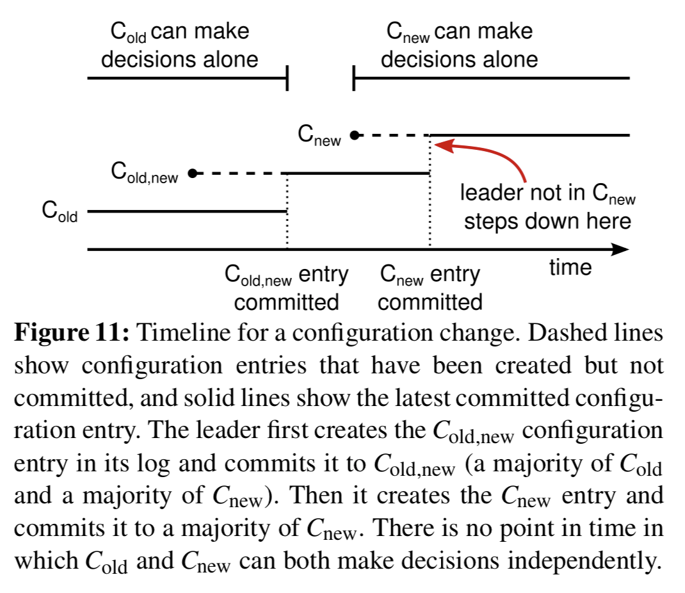
> > #### NOTES:
> > 1. 一旦联合配置被提交，不管新配置或者老配置都不能进行决定，leader的完整性保证在联合配置下只有一个leader可以被选举。
> > 2. 一旦leader当选，它就可以创建一条新配置的日志记录，并复制给其它节点。
> > 3. 另外，一旦机器看到新的配置就尽快生效。
> > 4. 当新的日志记录在新配置下被提交，那么老的配置就失去作用，那些不在新配置中的机器就可以下线了。
> > 5. 正如图11所示，不可能同时存在新配置或老配置单独进行决定的。这保证可安全性。

> There are three more issues to address for reconfigura- tion. The first issue is that new servers may not initially store any log entries. If they are added to the cluster in this state, it could take quite a while for them to catch up, during which time it might not be possible to com- mit new log entries. In order to avoid availability gaps, Raft introduces an additional phase before the configu- ration change, in which the new servers join the cluster as non-voting members (the leader replicates log entries to them, but they are not considered for majorities). Once the new servers have caught up with the rest of the cluster, the reconfiguration can proceed as described above.
> > #### NOTES:
> > 1. 更换配置存在三个问题：
> > - 第一个问题：
> >     - 新初始化的机器没有存储任何之前的日志。这台机器可能花费很久的时间才可以追赶上大家的状态，然后才可以提交新的日志记录。
> >     - 为了避免不可用的时间的长度，Raft在配置变更前引入了一个额外的阶段，这这个阶段只作为不投票的程票，只接受leader的日志复制，但是不能进行投票。

> The second issue is that the cluster leader may not be part of the new configuration. In this case, the leader steps down (returns to follower state) once it has committed the Cnew log entry. This means that there will be a period of time (while it is committing Cnew ) when the leader is man- aging a cluster that does not include itself; it replicates log entries but does not count itself in majorities. The leader transition occurs when Cnew is committed because this is the first point when the new configuration can operate in- dependently (it will always be possible to choose a leader from Cnew ). Before this point, it may be the case that only a server from Cold can be elected leader.
> > #### NOTES:
> > 1. 第二个问题是集群的leader可能不存在新的配置中，这种情况下，leader提交了新配置的日志，然后失去leader的权限。这就意味着在很长的一段时间内，leader将管理整个集群，但是这个集群的大多数不包含他自己。leader迁移发生在当新配置被提交，因为正是这个时刻新的配置可以独立执行。这个时刻之前，只有就配置的机器可以选举为leader。
 
> The third issue is that removed servers (those not in Cnew) can disrupt the cluster. These servers will not re- ceive heartbeats, so they will time out and start new elec- tions. They will then send RequestVote RPCs with new term numbers, and this will cause the current leader to revert to follower state. A new leader will eventually be elected, but the removed servers will time out again and the process will repeat, resulting in poor availability.
> > #### NOTES: 
> > 1. 移除机器可能打乱集群，这些机器将不会再接受心跳，它们将会超时并重启选举。
> > 2. 移除的机器将会发送携带新任期的请求选举的rpc，这将导致当前leader回退到follower的状态。
> > 3. 一个新的leader将会被重新选举，但是移除的机器将会再次超时，这个过程将不断重复导致集群的不可用。

> To prevent this problem, servers disregard RequestVote RPCs when they believe a current leader exists. Specif- ically, if a server receives a RequestVote RPC within the minimum election timeout of hearing from a cur- rent leader, it does not update its term or grant its vote. This does not affect normal elections, where each server waits at least a minimum election timeout before starting an election. However, it helps avoid disruptions from re- moved servers: if a leader is able to get heartbeats to its cluster, then it will not be deposed by larger term num- bers.
> > #### NOTES:
> > 1. 为了组织上面问题的发生，机器可以不理会RequestVote RPCs当它相信当前leader是存在的。
> > 2. 特殊的，如果一个server接受到一个选举请求rpc并携带了最小超时，这个超时是从leader那获得的，他就可以不更新自己的任期或投票。
> > 3. 这不影响正常的选举，每个server将等待至少一个最小超时时间在它们重启新的选举之前。
> > 4. 然而，它可以避免因为移除机器造成的集群混乱。
> > 5. 如果一个ledaer可以获得集群的心跳，它将不会被更大的任期废除。

> Raft’s log grows during normal operation to incorpo- rate more client requests, but in a practical system, it can- not grow without bound. As the log grows longer, it oc- cupies more space and takes more time to replay. This will eventually cause availability problems without some mechanism to discard obsolete information that has accu- mulated in the log.
> > #### NOTES:
> > 1. Raft的日志在正常处理客户端的请求下不断的增长，但是这是一个事实系统，不可能任由日志无限增长。
> > 2. 随着日志的不断增长，体制占据了更多的机器空间，重放的时候也将花费更多的时间。
> > 3. 如果没有一些机器可以及时的删除日志中的无用信息，最终会导致可影星问题。

> Snapshotting is the simplest approach to compaction. In snapshotting, the entire current system state is written to a snapshot on stable storage, then the entire log up to that point is discarded. Snapshotting is used in Chubby and ZooKeeper, and the remainder of this section de- scribes snapshotting in Raft.
> > #### NOTES:
> > 1. 快照是压缩日志的一种有效方法。
> > 2. 在快照中将保存整个系统的状态，并且快照将被持久化在稳定设备上。
> > 3. 然后快照点之前的日志就可以取消了。
> > 4. 快照也被应用在chubby和zookeper中，下面的章节将描述raft的快照。

> Incremental approaches to compaction, such as log cleaning [36] and log-structured merge trees [30, 5], are also possible. These operate on a fraction of the data at once, so they spread the load of compaction more evenly over time. They first select a region of data that has ac- cumulated many deleted and overwritten objects, then they rewrite the live objects from that region more com- pactly and free the region. This requires significant addi- tional mechanism and complexity compared to snapshot- ting, which simplifies the problem by always operating on the entire data set. While log cleaning would require modifications to Raft, state machines can implement LSM trees using the same interface as snapshotting.
> > #### NOTES:
> > 1. 除了快照，日志清理或者lsmtree的方法也是可以的，但是它们每次操作数据的一部分，将会使得压缩变的更加频繁。
> > 2. 首先选则一个堆积很多删除和重写对象的数据区域，然后更加紧凑的重写或者的对象，并释放这些区域。
> > 3. 上面的方法需要额外的机制和复杂度和快照相比。
> > 4. 相比之下，快照是操作整个数据集，可以简化操作。
> > 5. 另外日志清理需要修改Raft，状态机可以实现lsmtree使用和快照相同的接口。

> Figure 12 shows the basic idea of snapshotting in Raft. Each server takes snapshots independently, covering just the committed entries in its log. Most of the work con- sists of the state machine writing its current state to the snapshot. Raft also includes a small amount of metadata in the snapshot: the last included index is the index of the last entry in the log that the snapshot replaces (the last en- try the state machine had applied), and the last included term is the term of this entry. These are preserved to sup- port the AppendEntries consistency check for the first log entry following the snapshot, since that entry needs a pre- vious log index and term. To enable cluster membership changes (Section 6), the snapshot also includes the latest configuration in the log as of last included index. Once a server completes writing a snapshot, it may delete all log entries up through the last included index, as well as any prior snapshot.
> 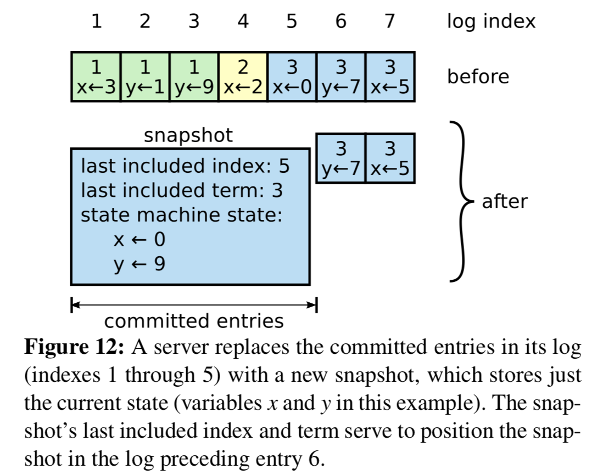
> > #### NOTES:
> > 1. 图12展示了Raft中快照的基本思想。
> > 2. 每台机器独立进行快照，然后快照包含自己日志中已提交的日志。
> > 3. 工作中的大部分是状态机将自己的状态写入到快照中。
> > 4. Raft的快照中也包含了一小部分的元信息。
> >     - last included index : 上一条被快照替换的日志记录的索引。
> >     - last included term : 是日志记录的任期。
> > 5. 这些将被保留用来支持追加日志一致性检测，对于快照后的下一条日志, 因为这条日志记录需要前一条日志记录的索引和任期。
> > 6. 为可支持集群成员变更，快宅童谣需要包含快照点下一跳日志的配置信息。
> > 7. 一旦一台机器完成了快照，它可以删除所有的快照点之前所有的日志记录。之前的快照点同样也可以删除。 

> Although servers normally take snapshots indepen- dently, the leader must occasionally send snapshots to followers that lag behind. This happens when the leader has already discarded the next log entry that it needs to send to a follower. Fortunately, this situation is unlikely in normal operation: a follower that has kept up with the leader would already have this entry. However, an excep- tionally slow follower or a new server joining the cluster (Section 6) would not. The way to bring such a follower up-to-date is for the leader to send it a snapshot over the network.
> > #### NOTES:
> > 1. 计算每个server正常情况下都是独立的进行快照备份，在某些情况下还是需要leader发送快照到那些快照滞后的机器。
> > 2. 上面的情况发生在leader已经删除了它需要复制给follower的日志。
> > 3. 幸运的是，这样的情况在正常的操作中是不会发生的：一个follower已经保持和leader一样的日志，然而一个异常满的follower或这一个新的机器加入都集群，这一种情况下需要leader通过网络发送快照才能使follower的日志追赶上。

> The leader uses a new RPC called InstallSnapshot to send snapshots to followers that are too far behind; see Figure 13. When a follower receives a snapshot with this RPC, it must decide what to do with its existing log en- tries. Usually the snapshot will contain new information not already in the recipient’s log. In this case, the follower discards its entire log; it is all superseded by the snapshot and may possibly have uncommitted entries that conflict with the snapshot. If instead the follower receives a snap- shot that describes a prefix of its log (due to retransmis- sion or by mistake), then log entries covered by the snap- shot are deleted but entries following the snapshot are still valid and must be retained.
> > #### NOTES:
> > 1. leader通过被称为InstallSnapshot的rpc来将快照发往那些日志非常落后的机器，如图13所示。
> > 2. 当一个follower接受这种复制快照的rpc，它必须决定怎么处理存在的日志记录。
> > 3. 通常快照将会包含新的信息而接受者日志中所没有的。
> > 4. 这种情况下，follower删除自己的日志，所有将被快照取代，同时也可能包含了为提交但和快照冲突的日志。
> > 5. 如果follower接受到一个快照描述日志的前缀，那么被快照覆盖的日志将会被删除，但是日志后面日志仍然是合法的必须被保留。

 

  

 
